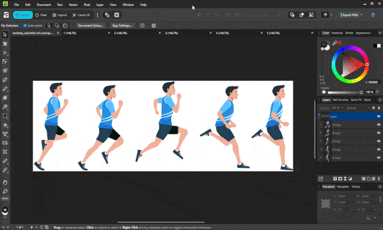

# Moiré Slit Animation (Scanimation) Print Generator

This script generates two printable files used to create a classic **barrier-grid / slit moiré (scanimation)** animation.

You print the **base image** on paper, print the **barrier mask** on a transparency, then slide the transparency across the base to reveal each frame one at a time—creating the illusion of motion.

## Output Files

The script writes files into the output folder (default: `output/`):

- `interlaced_base.png` → print on **paper**
- `barrier_mask.png` → print on **transparent film** (black bars block light, slits are transparent)
- `output/demo.gif` → example animation preview (already included)

> 

Tips

Make sure your printer is set to no scaling (100%).

## Requirements

Install dependencies:

```bash
pip install -r requirements.txt

