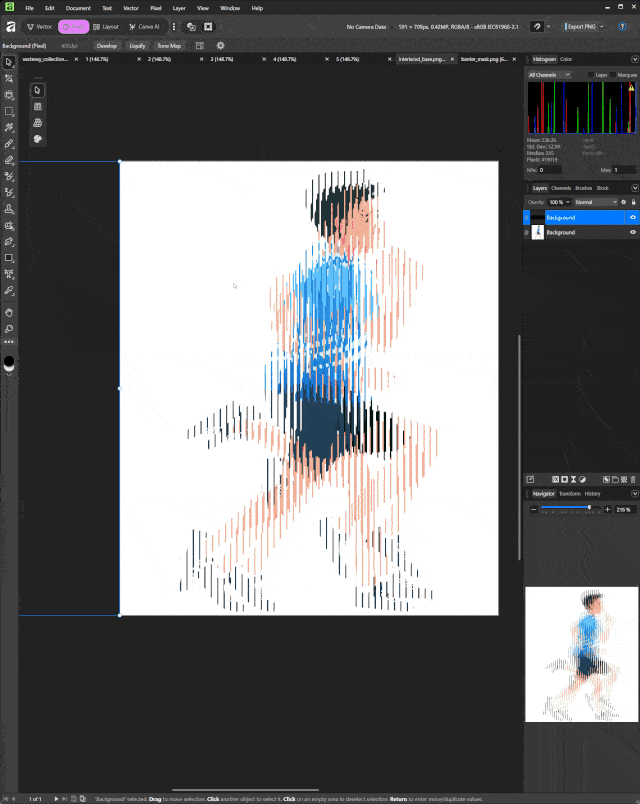

# Moire Animations

Scripts and generated assets for moire animation experiments.

## Slit Scanimation Print Generator

`main.py` generates two printable files used to create a classic
barrier-grid / slit moire animation.

Print the base image on paper, print the barrier mask on transparency, then
slide the transparency across the base to reveal each frame one at a time.

Output files are written into `output/` by default:

- `interlaced_base.png`: print on paper
- `barrier_mask.png`: print on transparent film



Install dependencies:

```bash
pip install -r requirements.txt
```

Use 100% printer scaling.

## Radial Number Clock

The `radial_numbers` folder contains a radial moire generator that creates a
printable base layer and a rotating transparency mask. The encoder-ring clock
mode reveals numbers `1` through `12` at 30-degree mask increments.

See `radial_numbers/README.md` for generation options, including deadzone,
invert, stable repeating paths, and encoder-ring clock settings.
