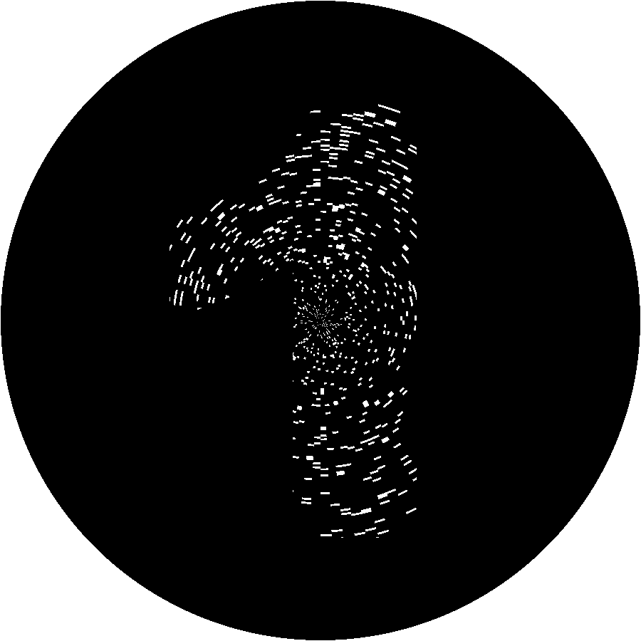
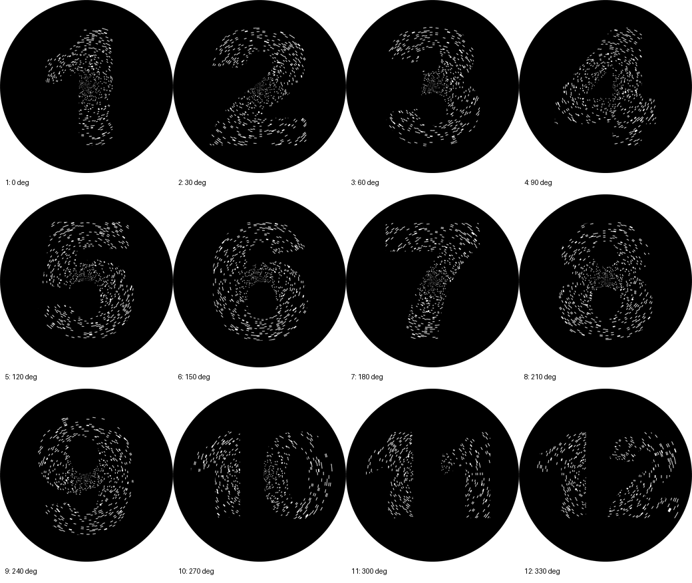

# Radial Moire Numbers

This folder generates a radial moire pattern that reveals full-circle numbers as
the transparency mask rotates.

The result is similar in principle to a slit scanimation sheet, but the stripes
are angular wedges around the center instead of vertical columns.

## Original Radial Scanline Output

The original radial scanline/repeating output is kept in:

```text
output/
```

It contains:

- `radial_interlaced_base.png`
- `radial_barrier_mask.png`
- `previews/reveal_01.png` through `previews/reveal_12.png`

## Generate Encoder Ring Clock

```powershell
python .\radial_numbers\radial_moire_numbers.py --mode encoder-ring-clock --preview-angles-deg 0,1,29,30,31 --output radial_numbers/output_encoder_ring_clock
```

Final outputs are written to `radial_numbers/output_encoder_ring_clock`:

- `radial_interlaced_base.png`: print on paper
- `radial_barrier_mask.png`: print on transparency
- `previews/reveal_01.png` through `previews/reveal_12.png`: simulated reveal states
- `previews/contact_sheet.png`: all 12 reveal states in one image
- `previews/angle_diagnostics.png`: 0, 1, 29, 30, and 31 degree stability check
- `rotation_360_slow_in_pause_numbers.gif`: 360 degree encoder-ring animation
- `rotation_360_slow_in_pause_numbers_inverted.gif`: inverted 360 degree encoder-ring animation





## Stable Repeating Path

Use this when you want the last visually stable version: 96 repeated radial
periods, with the mask phase repeating every 3.75 degrees.

```powershell
python .\radial_numbers\radial_moire_numbers.py --stable-path --output radial_numbers/output_stable_96
```

Equivalent explicit form:

```powershell
python .\radial_numbers\radial_moire_numbers.py --mode stable-repeating --periods 96
```

With 12 numbers and 96 periods, each number phase is:

```text
360 / (12 * 96) = 0.3125 degrees
```

The full pattern phase repeats every:

```text
360 / 96 = 3.75 degrees
```

## Useful Options

```powershell
python .\radial_numbers\radial_moire_numbers.py --diameter-mm 180 --dpi 400 --periods 96
```

- `--diameter-mm`: printed circle diameter.
- `--dpi`: output resolution.
- `--periods`: number of repeated moire cycles around the circle.
- `--deadzone-mm`: black center radius. `0` keeps the pattern all the way to
  the center; larger values leave a solid black circle in the middle.
- `--invert`: invert base, mask display colors, and previews while preserving
  mask transparency.

Higher `--periods` values make the numbers more complete because each number is
sampled by more radial slits. They also make the transparent slits narrower and
require more precise printing and rotation.

Lower `--periods` values make the pattern easier to print but the revealed
number becomes more segmented.

## 12-Hour Clock Rotation

Use clock-key mode when the transparency should reveal the next number every 30
degrees, completing all 12 numbers in one full mask rotation.

```powershell
python .\radial_numbers\radial_moire_numbers.py --mode clock-key --rotation-step-deg 30 --output radial_numbers/output_clock_30
```

This mode intentionally avoids 12-fold radial symmetry in the slit mask. A
symmetrical 96-period mask repeats every 3.75 degrees, so a 30-degree turn would
land on the same mask phase instead of a new number.

Useful clock-key options:

- `--clock-spokes`: number of transparent radial slits in the mask.
- `--clock-slit-angle-deg`: angular width of each transparent slit.
- `--clock-hold-deg`: angular window where the base keeps the same number
  visible around each target angle.
- `--clock-seed`: deterministic layout seed if you want a different slit layout.

In clock-key mode, larger `--clock-spokes` and wider `--clock-slit-angle-deg`
make the revealed numbers brighter, but they also increase the chance of slit
overlap between adjacent 30-degree reveal positions.

The default clock-key settings use 96 spokes, 0.12-degree slits, and a
3-degree hold window. At a 180 mm diameter, the transparent slit is about
0.19 mm wide at the outer edge.

## Encoder Ring Clock

This is the recommended 12-hour physical clock path. It uses broken ring
segments, like encoder tracks, instead of continuous radial spokes. The mask has
short transparent arc segments in each ring; the base has matching arc segments
shifted by 30 degrees for each number.

```powershell
python .\radial_numbers\radial_moire_numbers.py --mode encoder-ring-clock --preview-angles-deg 29,30,31 --output radial_numbers/output_encoder_ring_clock
```

The base uses a wider hold window for each number while the transparency keeps
a narrow slit. With the default `--clock-hold-deg 3`, a number remains stable
around its target angle instead of cycling through all 12 numbers between
29 and 31 degrees.

This implements the useful learning from the multi-ring paper: density is
distributed across concentric rings, while each local ring segment remains a
simple high-contrast optical feature. The old `multi-ring-clock` mode name is
still accepted as an alias for this encoder-ring implementation.

Useful encoder-ring options:

- `--rings`: number of concentric rings.
- `--encoder-angular-cells`: angular cell count. Must be divisible by `--numbers`.
- `--clock-hold-deg`: angular stability window around each 30-degree target.
- `--preview-angles-deg`: extra preview angles for checking stability.
- `--invert`: invert base, mask display colors, and previews while preserving
  mask transparency.

## Encoder Ring Animation

The current checked-in animation is:

```text
output_encoder_ring_clock/rotation_360_slow_in_pause_numbers.gif
```

It rotates through all 12 numbers, slows down before each 30-degree reveal
position, and pauses for one second on each number.

The inverted version is:

```text
output_encoder_ring_clock/rotation_360_slow_in_pause_numbers_inverted.gif
```

Use `--periods 1` only if you specifically want a 30-degree step between numbers;
the reveal will be much coarser because each number gets only one large wedge.

## Center Deadzone

```powershell
python .\radial_numbers\radial_moire_numbers.py --deadzone-mm 20
```

This leaves a 20 mm radius black circle in the center on both the base and the
mask. It can help hide the visually dense convergence point of the radial slits.
